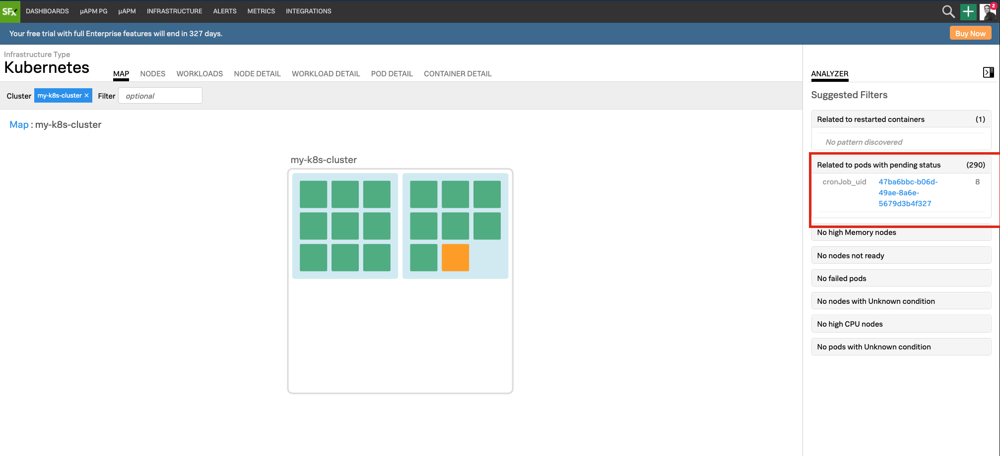

### Create a CronJob and simulate an error
A [CronJob](https://kubernetes.io/docs/concepts/workloads/controllers/cron-jobs/) in Kubernetes creates job on a repeatable schedule and is written in [Cron](https://en.wikipedia.org/wiki/Cron) format.

=== "Shell Command"
    ```
        kubectl apply -f hungry.yaml
    ```
=== "OUTPUT"
    ```
        cronjob.batch/hungry-job created
    ```
By looking at the workload status in Kubernetes Navigator, we can see that Kubernetes has not scheduled a pod for this CronJob. 
We can use Kubernetes Analyzer to identify and expedite triage process. To understand the “why” behind performance anomalies, Kubernetes Navigator leverages AI-driven analytics, which automatically surfaces insights and recommendations to precisely answer, in real-time, what is causing anomalies across the entire Kubernetes cluster – nodes, pods, containers, and workloads.
Click to expand Kubernetes Analyzer
{: .zoom} 
Kubernetes Analyzer helps us understand the “why” behind performance anomalies by leveraging AI-driven analytics, which automatically surfaces insights and recommendations to precisely answer, in real-time, what is causing anomalies across the entire Kubernetes cluster – nodes, pods, containers, and workloads.
{: .zoom} 